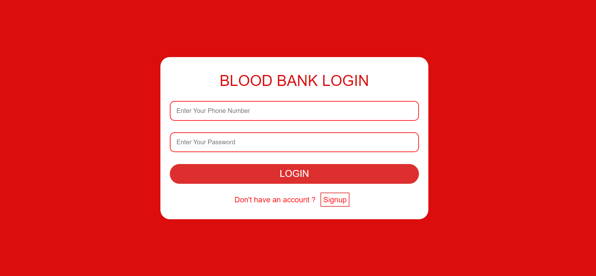
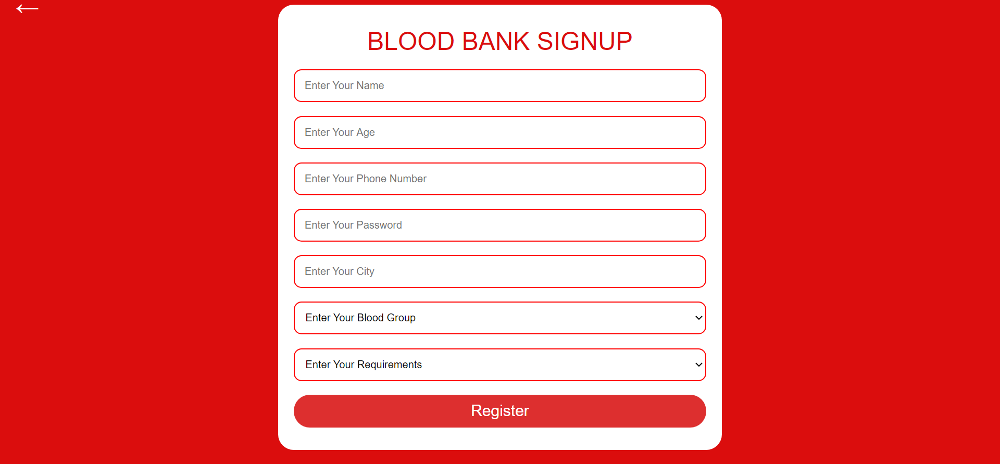
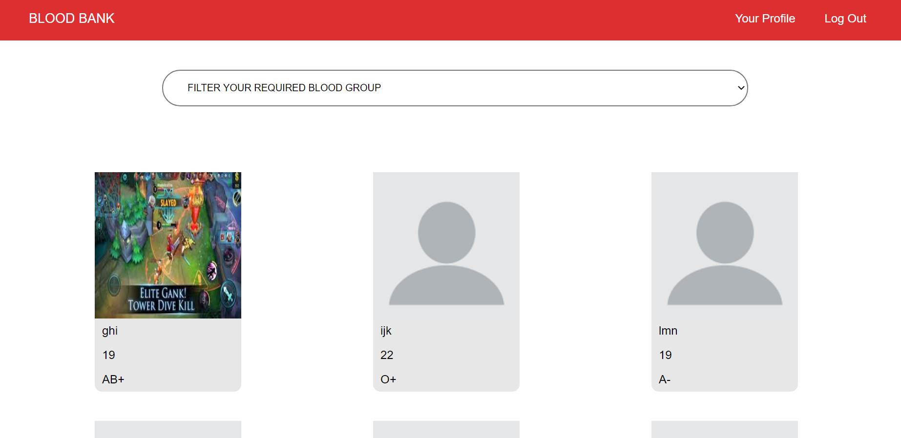
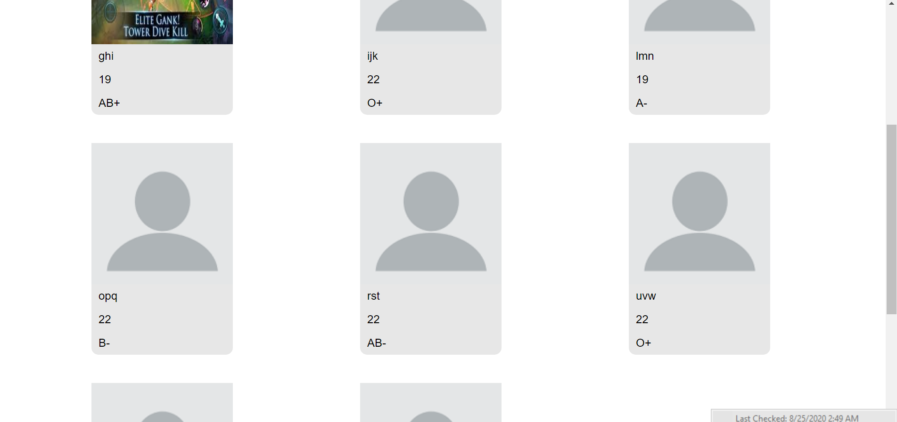
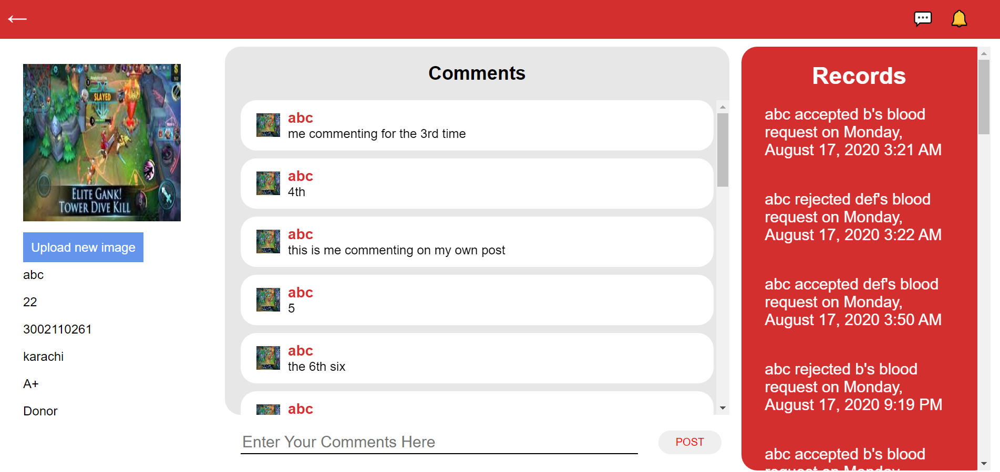
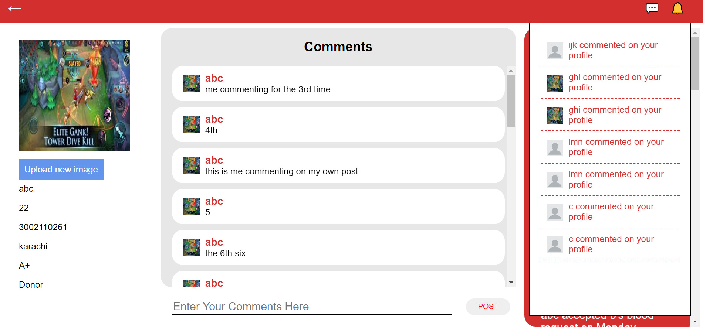
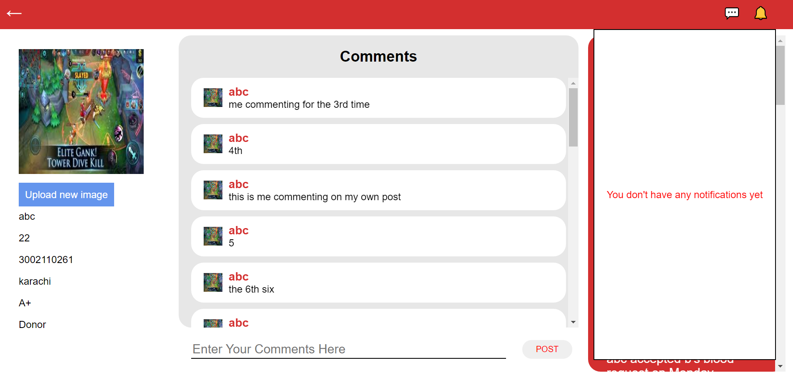

# BLOOD BANK APPLICATION

This project is made by me as a university project. I was a C# guy but seeing the usefulness of javascript i wanted to get into javascript with the eventual goal of becoming a MERN stack developer. This project gave me a proper launcing pad for getting into javascript from C#.

## Motivation

Learning a new language especially when you are shifting from one of your favourite language (C# in my case) can be tough. Now in a university project, one has to deliver the application by hook or by crooks, so i thought that when the pressure would be on me maybe i will learn the MERN stack quicker than normal and in an application like Blood Bank i would learn a lot of new things along the way which is exactly what happen and hence this application is made 

## Screenshots

### LoginPage

### SignupPage

### DashboardPage 

### DashboardPage2

### MyProfilePage

### MessageNotificationDropDown 

### NotificationDropDown

## Tech/framework used

This project uses the MERN stack which is Mongodb, ExpressJS, ReactJS, and NodeJS.

### Built with

This project is built in vs code on the Windows 10 platform
    
## Features

In this project one can:
1. Comment on other people profile
2. Change the profile picture
3. Request and decline blood donation request
4. View Other Users Profile
5. Receive alert messages with a little blue dot on a new message or a new blood donation request

## Installation and Usage

1. Clone the blood bank folder on your preferred location on your local device.
2. Open the cloned folder in visual studio code.
3. Open the terminal using ctrl+`.
4. Go into the frontend directory from the terminal by cd frontend
5. After getting into the frontend folder, write the command npm install and press enter to download all the required dependancies for the frontend(Might take few minutes).
6. After installing all the required dependancies, run the command npm start and wait for the developental server to start.
7. Afterwards go back into the terminal in vs code and click on the + button on the top left of the terminal to open a new terminal.
8. In the new terminal write cd backend and then write the command npm install and press enter to download all required dependancies for the backend(Might take few minutes).
9. After installing all the required dependancies, run the command npm start and wait for the logged message "db connected successfully","up and runnng".
10. Signup with your number and password and start exploring the app.
11. I have not uploaded the .env file, so the secret key for the json web token and the secret link of the mongodb database in the mongodb atlas are not uploaded.
12. If any one has any query email me at abidihaider89@gmail.com

### Credits

This project is made only because of a couple of youtube channels namely 

1. NetNinja (link: https://www.youtube.com/channel/UCW5YeuERMmlnqo4oq8vwUpg)

2. DevEd (link: https://www.youtube.com/channel/UClb90NQQcskPUGDIXsQEz5Q) 

and due to my two of of my awesome instructors

1. Sir Muhammad Danish Siddique (github_link: https://github.com/mdanishs) 

2. Sir Syed Saad Ahmad (github_link: https://github.com/syedsaadahmed)

### CopyRight
 © Syed Haider Imam Abidi
